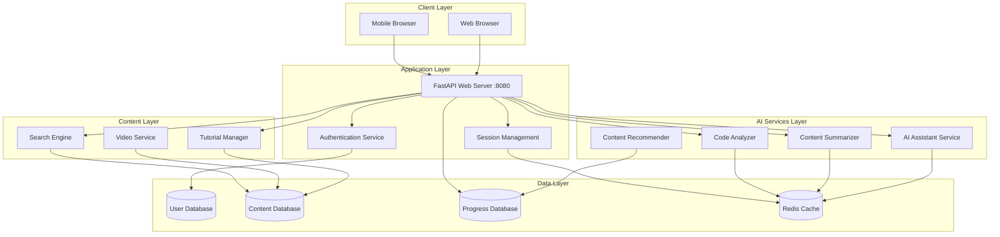

# Design Document: Student Learning Platform

## Overview

The Student Learning Platform is a modern, AI-powered web application built with Python that helps students learn technology concepts more effectively. The platform combines multiple AI capabilities including conversational assistants, content summarization, and intelligent code analysis to create a comprehensive learning environment.

The system follows a microservices-inspired architecture with clear separation between the web framework layer, AI processing services, content management, and user data persistence. This design ensures scalability, maintainability, and the ability to integrate multiple AI providers and educational content sources.

## Architecture

### High-Level Architecture



### Technology Stack

**Web Framework**: FastAPI
- Modern, high-performance Python web framework
- Automatic API documentation with OpenAPI/Swagger
- Built-in async support for handling concurrent AI requests
- Type hints for better code quality and IDE support

**AI/ML Libraries**:
- **LangChain**: Framework for building AI applications with LLMs
- **OpenAI API**: Primary language model for AI assistant and summarization
- **Transformers**: Hugging Face library for additional NLP capabilities
- **Sentence-Transformers**: For semantic search and content similarity

**Database & Storage**:
- **SQLite/PostgreSQL**: User data, progress tracking, and content metadata
- **Redis**: Session management and AI response caching
- **File System**: Video and document storage with cloud backup options

**Frontend**:
- **HTML/CSS/JavaScript**: Responsive web interface
- **WebSocket**: Real-time communication for AI chat features
- **Video.js**: Video player for tutorial content

## Components and Interfaces

### 1. Web Server Component (FastAPI Application)

**Responsibilities**:
- Handle HTTP requests and WebSocket connections
- Route requests to appropriate services
- Manage user authentication and sessions
- Serve static content and API endpoints

**Key Interfaces**:
```python
# Main application routes
@app.post("/api/chat")
async def chat_with_assistant(message: ChatMessage, user: User) -> ChatResponse

@app.post("/api/summarize")
async def summarize_content(content: ContentRequest, user: User) -> SummaryResponse

@app.post("/api/analyze-code")
async def analyze_code(code: CodeRequest, user: User) -> AnalysisResponse

@app.get("/api/tutorials/search")
async def search_tutorials(query: str, filters: TutorialFilters) -> List[Tutorial]

@app.post("/api/progress/update")
async def update_progress(progress: ProgressUpdate, user: User) -> ProgressResponse
```

### 2. AI Assistant Service

**Responsibilities**:
- Process natural language queries from students
- Maintain conversation context and history
- Provide educational guidance and explanations
- Generate personalized learning recommendations

**Core Implementation**:
```python
class AIAssistantService:
    def __init__(self, llm_provider: LLMProvider, context_manager: ContextManager):
        self.llm = llm_provider
        self.context = context_manager
    
    async def process_query(self, user_id: str, message: str) -> AssistantResponse:
        # Retrieve conversation context
        context = await self.context.get_context(user_id)
        
        # Build educational prompt with context
        prompt = self._build_educational_prompt(message, context)
        
        # Generate response using LLM
        response = await self.llm.generate_response(prompt)
        
        # Update context and return
        await self.context.update_context(user_id, message, response)
        return AssistantResponse(content=response, context_updated=True)
```

### 3. Content Summarization Service

**Responsibilities**:
- Process various content formats (text, PDFs, URLs)
- Generate concise, educational summaries
- Preserve technical terminology and key concepts
- Support adjustable summary lengths

**Implementation Strategy**:
- Use LangChain's MapReduce approach for large documents
- Implement chunking strategy for content that exceeds token limits
- Cache summaries to improve performance for repeated content
- Support multiple output formats (bullet points, paragraphs, key concepts)

```python
class ContentSummarizer:
    def __init__(self, llm_chain: LLMChain, document_loader: DocumentLoader):
        self.chain = llm_chain
        self.loader = document_loader
    
    async def summarize(self, content_source: str, summary_type: SummaryType) -> Summary:
        # Load and chunk content
        documents = await self.loader.load_content(content_source)
        chunks = self._chunk_documents(documents)
        
        # Apply map-reduce summarization
        if len(chunks) > 1:
            return await self._map_reduce_summarize(chunks, summary_type)
        else:
            return await self._direct_summarize(chunks[0], summary_type)
```

### 4. Python Code Analyzer

**Responsibilities**:
- Analyze Python codebases and individual files
- Generate high-level architectural overviews
- Explain complex code patterns and workflows
- Provide educational insights about code structure

**Analysis Capabilities**:
- **Static Analysis**: Parse AST to understand code structure
- **Complexity Analysis**: Identify complex functions and suggest simplifications
- **Pattern Recognition**: Detect common design patterns and explain their usage
- **Educational Explanations**: Generate beginner-friendly explanations of code functionality

```python
class PythonCodeAnalyzer:
    def __init__(self, ast_parser: ASTParser, llm_explainer: LLMExplainer):
        self.parser = ast_parser
        self.explainer = llm_explainer
    
    async def analyze_codebase(self, code_source: str) -> CodebaseAnalysis:
        # Parse code structure
        ast_tree = self.parser.parse(code_source)
        structure = self._extract_structure(ast_tree)
        
        # Generate educational explanation
        explanation = await self.explainer.explain_codebase(structure)
        
        return CodebaseAnalysis(
            structure=structure,
            explanation=explanation,
            complexity_metrics=self._calculate_complexity(ast_tree),
            learning_suggestions=self._generate_learning_path(structure)
        )
```

### 5. Tutorial and Content Management System

**Responsibilities**:
- Manage video tutorials and educational content
- Track student progress through content
- Provide content recommendations
- Support content search and filtering

**Content Organization**:
- **Categories**: Technical vs. non-technical content
- **Difficulty Levels**: Beginner, Intermediate, Advanced
- **Prerequisites**: Define learning dependencies
- **Progress Tracking**: Monitor completion and engagement metrics

### 6. User Progress and Skill Tracking

**Responsibilities**:
- Track learning progress across different topics
- Maintain skill level assessments
- Generate personalized learning paths
- Provide achievement and milestone notifications

**Progress Metrics**:
- **Content Completion**: Videos watched, tutorials completed
- **Engagement Metrics**: Time spent, questions asked, code analyzed
- **Skill Assessments**: Periodic evaluations of understanding
- **Learning Velocity**: Rate of progress through different topics

## Data Models

### User Model
```python
class User:
    id: str
    email: str
    username: str
    password_hash: str
    created_at: datetime
    last_login: datetime
    preferences: UserPreferences
    skill_levels: Dict[str, SkillLevel]
```

### Content Models
```python
class Tutorial:
    id: str
    title: str
    description: str
    category: ContentCategory
    difficulty_level: DifficultyLevel
    duration_minutes: int
    video_url: Optional[str]
    content_text: str
    prerequisites: List[str]
    tags: List[str]

class UserProgress:
    user_id: str
    content_id: str
    progress_percentage: float
    completed_at: Optional[datetime]
    time_spent_minutes: int
    last_accessed: datetime
```

### AI Interaction Models
```python
class ChatMessage:
    user_id: str
    message: str
    timestamp: datetime
    context: Optional[Dict]

class ChatResponse:
    response: str
    confidence: float
    suggested_resources: List[str]
    follow_up_questions: List[str]

class SummaryRequest:
    content_source: str  # URL, file path, or direct text
    content_type: ContentType
    summary_length: SummaryLength
    focus_areas: List[str]
```

## Correctness Properties

*A property is a characteristic or behavior that should hold true across all valid executions of a system—essentially, a formal statement about what the system should do. Properties serve as the bridge between human-readable specifications and machine-verifiable correctness guarantees.*

Based on the requirements analysis, the following properties ensure the system behaves correctly across all valid inputs and scenarios:

### Property 1: AI Assistant Response Quality and Context Isolation
*For any* student question and user session, the AI Assistant should provide relevant educational responses within 5 seconds while maintaining separate conversation contexts for each user, ensuring no context bleeding between concurrent sessions.
**Validates: Requirements 1.1, 1.2, 1.3**

### Property 2: AI Assistant Clarification Behavior
*For any* ambiguous or unclear student question, the AI Assistant should respond with clarifying questions rather than making assumptions about the student's intent.
**Validates: Requirements 1.4**

### Property 3: Conversation History Persistence
*For any* student session, all conversation history should be stored and retrievable throughout the session lifecycle.
**Validates: Requirements 1.5**

### Property 4: Content Search and Organization
*For any* search query, the Tutorial System should return relevant content properly organized by difficulty level and category, with appropriate filtering capabilities.
**Validates: Requirements 2.1, 2.3, 8.1, 8.2**

### Property 5: Progress Tracking and Resume Functionality
*For any* learning activity or tutorial, the system should accurately track progress and allow resuming from the last position across all content types.
**Validates: Requirements 2.2, 5.1**

### Property 6: Content Recommendation Consistency
*For any* completed learning activity, the system should provide relevant follow-up recommendations based on the content and user's learning profile.
**Validates: Requirements 2.4, 5.4, 8.4**

### Property 7: Bookmark and Preference Persistence
*For any* user customization (bookmarks, preferences, dashboard settings), changes should persist across sessions and be reflected in the user interface.
**Validates: Requirements 2.5, 7.5**

### Property 8: Code Analysis Comprehensiveness
*For any* code input (individual files or codebases), the Python Tool should provide structured analysis including functionality explanations, architectural overviews, and educational insights with examples and analogies.
**Validates: Requirements 3.1, 3.2, 3.3, 3.5**

### Property 9: Multi-Language Code Support
*For any* supported programming language, the Python Tool should successfully analyze and explain code with consistent quality across different languages.
**Validates: Requirements 3.4**

### Property 10: Content Summarization Quality and Format Support
*For any* input content (text, PDF, URL), the Content Summarizer should generate accurate summaries that preserve technical terminology, provide bullet-point formatting, and support adjustable length settings.
**Validates: Requirements 4.1, 4.2, 4.3, 4.4, 4.5**

### Property 11: Skill Progression and Achievement System
*For any* learning milestone or proficiency demonstration, the Skill Tracker should update skill levels, unlock appropriate content, provide visual progress representation, and trigger achievement notifications.
**Validates: Requirements 5.2, 5.3, 5.5**

### Property 12: Cross-Platform Web Accessibility
*For any* standard web browser and device type, the Learning Platform should provide a responsive, functional interface that maintains usability across desktop and mobile platforms.
**Validates: Requirements 6.3**

### Property 13: Session Management and Authentication
*For any* user registration and login attempt, the system should securely handle credentials with proper encryption, maintain session state across browser sessions, and restore user context upon return.
**Validates: Requirements 6.4, 7.1, 7.2, 7.3, 7.4**

### Property 14: Search Fallback and Suggestions
*For any* search query that returns no exact matches, the system should provide alternative search terms and related topic suggestions to guide continued learning.
**Validates: Requirements 8.3**

### Property 15: Content Metadata Completeness
*For any* content item displayed to users, all required metadata (difficulty level, duration, prerequisites, category) should be visible and accurate.
**Validates: Requirements 8.5**

## Error Handling

### AI Service Error Handling
- **LLM API Failures**: Implement circuit breaker pattern with fallback to cached responses or alternative providers
- **Context Overflow**: Automatically summarize or truncate conversation history when approaching token limits
- **Rate Limiting**: Queue requests and provide user feedback when API limits are reached
- **Invalid Input**: Sanitize and validate all user inputs before processing by AI services

### Content Processing Error Handling
- **File Format Errors**: Graceful handling of unsupported formats with clear error messages
- **Large File Processing**: Implement chunking strategies with progress indicators for large documents
- **Network Failures**: Retry mechanisms for external content fetching with exponential backoff
- **Parsing Errors**: Fallback to alternative parsing methods or manual content extraction

### Database and Session Error Handling
- **Connection Failures**: Implement connection pooling with automatic retry and failover
- **Data Corruption**: Validate data integrity with checksums and provide recovery mechanisms
- **Session Expiry**: Graceful session renewal with minimal user disruption
- **Concurrent Access**: Handle race conditions in progress tracking and user data updates

### User Experience Error Handling
- **Timeout Handling**: Provide clear feedback for long-running operations with cancel options
- **Offline Capability**: Cache essential content for limited offline functionality
- **Graceful Degradation**: Maintain core functionality even when advanced AI features are unavailable
- **Error Recovery**: Provide clear paths for users to recover from error states

## Testing Strategy

### Dual Testing Approach

The testing strategy employs both unit testing and property-based testing to ensure comprehensive coverage:

**Unit Tests**: Focus on specific examples, edge cases, and integration points between components. These tests validate concrete scenarios and ensure individual components work correctly in isolation.

**Property Tests**: Verify universal properties across all inputs using randomized test data. These tests ensure the system behaves correctly across the full range of possible inputs and scenarios.

### Property-Based Testing Configuration

**Framework**: Use Hypothesis (Python) for property-based testing
- **Minimum Iterations**: 100 iterations per property test to ensure statistical confidence
- **Test Tagging**: Each property test must reference its design document property
- **Tag Format**: `# Feature: student-learning-platform, Property {number}: {property_text}`

### Unit Testing Focus Areas

**Specific Examples**:
- Authentication flow with valid/invalid credentials
- Content upload and processing for known file formats
- AI response formatting and structure validation
- Database operations with known data sets

**Edge Cases**:
- Empty search queries and malformed inputs
- Maximum file size limits and content length boundaries
- Concurrent user sessions and race conditions
- Network timeouts and service unavailability

**Integration Points**:
- AI service integration with proper error handling
- Database transactions and data consistency
- Session management across browser restarts
- Content recommendation algorithm accuracy

### Testing Infrastructure

**Test Environment Setup**:
- Isolated test databases with known data sets
- Mock AI services for consistent testing
- Automated test data generation for property tests
- Performance benchmarking for response time validation

**Continuous Integration**:
- Automated test execution on code changes
- Property test failure analysis and reporting
- Performance regression detection
- Security vulnerability scanning

The combination of unit and property-based testing ensures both concrete functionality validation and comprehensive behavioral verification across all system components.